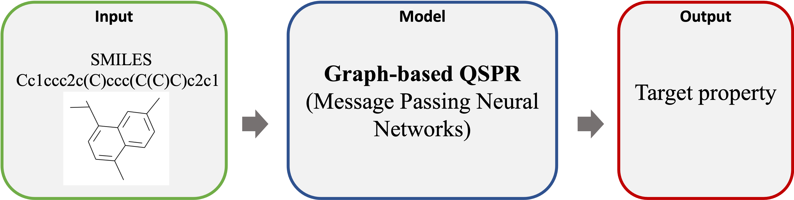

# Graph-Based-QSPR
A Deep Learning QSPR using graph neural networks for molecular property predictions.

<p align="center">

</p>

## Usage:

Run property.py

### Training arguments
**The following training arguments are required.**
- data path: file path(s) of training dataset.
- save path: directory where trained model and other generated files were saved.
- model name: filename of the trained model
- dataset type: task(s) of the target property, including classification, regression, fingerprint and smiles. 
- task name: name(s) of the target property.
- scaler path: file path of mean and std of molecule property.
- loss function
- metric
- output dimension
```
train_arguments.data_path = ["./tests/data/TC_train.csv"]
train_arguments.save_path = "./tests/TC"
train_arguments.model_name = "TC.pkl"
train_arguments.dataset_type = ["regression"]
train_arguments.task_names = ["homo"]
train_arguments.scaler_path = ["./tests/data/TC_scaler.csv"]
train_arguments.loss_function = ["mse"]
train_arguments.loss_function = ["mse"]
train_arguments.output_dim = [1]
```
 **csv format of training (or testing) dataset file:**
 
| smiles                             | TC         | 
| ---------------------------------- | ------------ | 
| C(C([N+](=O)[O-])([N+](=O)[O-])F)N(CC([N+](=O)[O-])([N+](=O)[O-])F)C(=O)OCC([N+](=O)[O-])([N+](=O)[O-])F	   | 939.0 |
| CCCCCCCCCCCCCCCCCCC1=C(C=CC(=C1)C)C	                 | 795.0 |
| C1C(COC1=O)O	             | 679.0 |
| COC1=CC=C(C=C1)C=C(C#N)C2=CC=CC=C2	             | 888.0 |
| CC1=CC=CC(C=C1)(C)C	                         | 656.0 | 
| CCCCOC(=O)C(Cl)Cl           | 655.0 |

**Other training arguments**
- save graphs path: save the file path of graphs according to training samples (compounds).
- load graphs path: load the file path of saved graphs. (No need to convert SMILES to Moleule graphs.)
- NN: The type of Graph Neural Networks (MPNN, Set2SetNN, ReadoutNN, NN), default = MPNN. 
- is explicit H: whether the molecule structure considered hydrogens or not, default = True.
- selective sampling: conditions of selective sampling,

  (1) M: portion of dataset selected for each round, default = 0.2.
  
  (2) N: number of rounds, default = 5.
  
  (3) task: the selected property.
  
- epoch: default = 1000.
- lr: learning rate, default = 0.0005.
- batch size: default = 128.
- earlystopping: default = 50

```
train_arguments.load_graphs_path = "train_graphs.bin"
train_arguments.NN = "MPNN"
train_arguments.is_explicit_H = True
train_arguments.selective_sampling = {"M": 0.2, "N": 5, "task": propName}
train_arguments.epoch = 1000
train_arguments.lr = 5e-4
train_arguments.batch_size = 128
train_arguments.early_stopping = 50
```

### Testing arguments
**The following testing arguments are required.**
- data path: file path(s) of testing dataset.
- save path: file path(s) of prediction results.
- model path: file path of the model for prediction.
- dataset type: task(s) of the target property, including classification, regression, fingerprint and smiles. 
- task name: name(s) of the target property.
- loss function
- metric
- output dimension
```
test_arguments.data_path = ["./tests/data/TC_test.csv"]
test_arguments.save_path = ["TC_test_pred.csv"]
test_arguments.model_path = "TC.pkl"
test_arguments.task_names = ["TC"]
test_arguments.dataset_type = ["regression"]
test_arguments.loss_function = ["mse"]
test_arguments.metric = ["mse"]
```

**Other testing arguments**
- save graphs path: save the file path of graphs according to testing samples (compounds).
- load graphs path: load the file path of saved graphs.

```
test_arguments.load_graphs_path = "test_graphs.bin"
```

### Molecule property prediction results

results directory: <a href="./tests/TC"> TC results directory</a>
